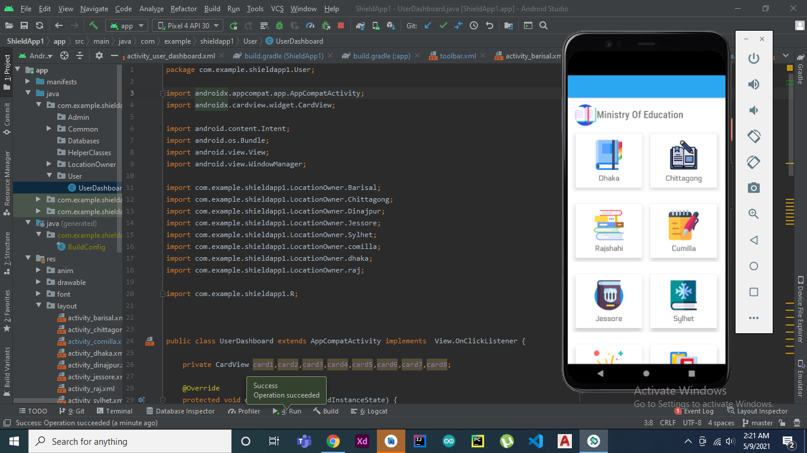
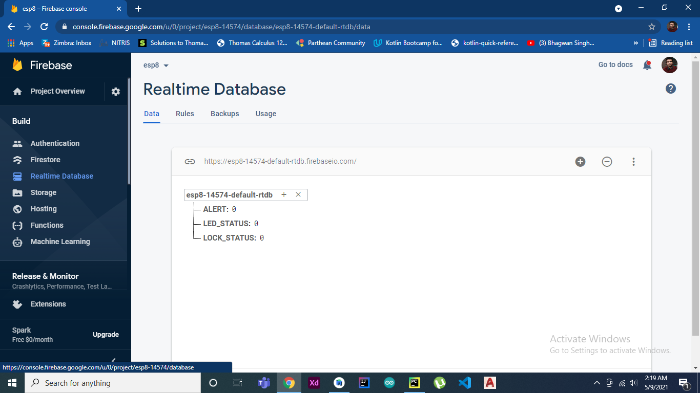
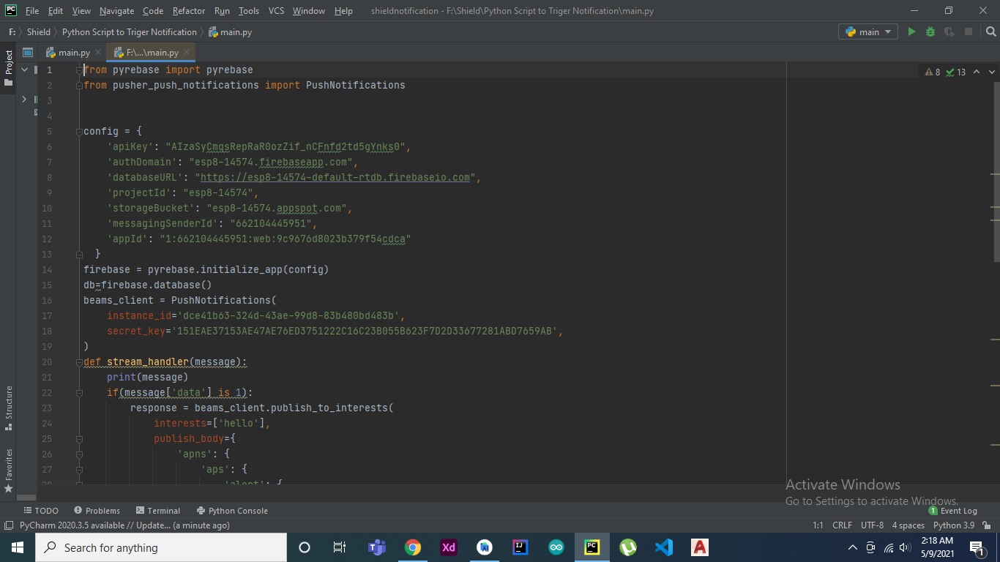
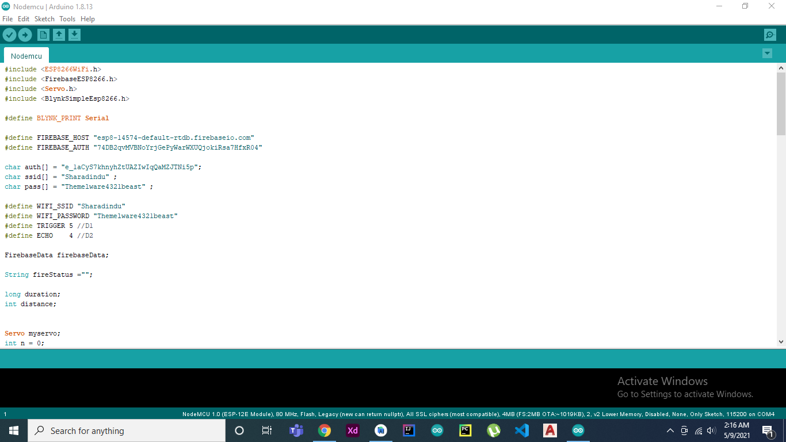

# Shield
SHIELD is a project about terminating the question paper piracy in Bangladesh.
## Problem
Question paper piracy is a critical issue in BANGLADESH due to which people with power gets to secure seats while those who deserve it are left helpless. . There are many ways that question papers have been pirated over the years but most of the time, culprits cut the packet of the question paper, take a snap of it and share it over internet.
## How SHIELD would solve it:

We will send question paper to the institutions in a box. By using the App called "Shield" the box can be locked from inside over internet and if someone breaks the box with any authorization of the Ministry of Education it will send an immediate email and notification to the nearest police station and the ministry of education.

__Here is a short clip demonstrating my project:__

https://youtu.be/ZPBS2nfLD30

## Screenshots

         
         

## App Features

- In the app dashboard there are eight different card views consisting the name of the Board under Ministry of Education. For instance Dhaka, Chittagong, Rajshahi, Comilla, Jessore, Sylhet, Dinajpur and Barisal.
- Say we want to LOCK all the boxes under Dhaka Board then we can head over to the Dhaka Board CardView.
- Here we can see the LOCK and UNLOCK button.
- Underneath that we can see the basic information of Dhaka Board.
- If the Authority presses the LOCK button all the boxes under Dhaka board will be LOCKED from inside over internet.
- If some culprits break the box without any authorization of the Ministry of Education the App will send an immediate email and notifiaction to the nearest Police station and the Ministry of Education. 

## Built With
- For The Android App I have used __JAVA__
- To program NodeMCU (Single-board microcontroller) I have used __C++__
- After analyzing all the sensor data for triggering automated puch notification I have used __Python__
- For the realtime database management I have used __Firebase__

         

## Sensors and Microcontroller
- NodeMCU ESP8266(Single-board microcontroller)
- Ultrasonic Sensor
- Servo Motor

Code Link : https://github.com/prateek27das/Nodemcu

## Sensor Alert Puch Notification
- Analyzing the sensor data to trigger a puch notification I have used Python.
- Library-Pyrebase

Code Link : https://github.com/prateek27das/Shield_Notification-

## Installation
- On GitHub, navigate to the main page of the repository.
- Above the list of files, click  Code.
- To clone the repository using HTTPS, under "Clone with HTTPS", click the copy sign. To clone the repository using an SSH key, including a certificate issued by your organization's SSH certificate authority, click the copy sign Use SSH, then click the copy sign . To clone a repository using GitHub CLI, click the copy sign Use GitHub CLI, then click the copy sign.
- Open Git Bash.
- Change the current working directory to the location where you want the cloned directory.
- Type git clone, and then paste the URL you copied earlier.

      $ git clone https://github.com/prateek27das/Shield
      
## Libraries Used
- Firebase cloud storage as the NOSQL database
- Cloud messaging for push notification
      
## Future Prespects
- Global Expantion.
- Feature Enhancement.
- Realtime chat and call accessibility between the Institutions and the  Ministry of Education.
- Realtime Location Tracking of the BOX.
- Convert the whole Android App codebase into Kotlin.

## Contributing
- Fork it
- Create your feature branch (git checkout -b my-new-feature)
- Commit your changes (git commit -m 'Add some feature')
- Push your branch (git push origin my-new-feature)
- Create a new Pull Request

