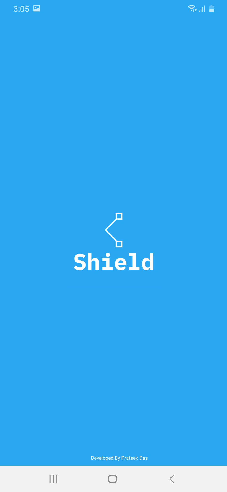
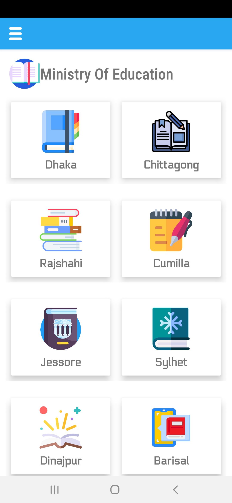
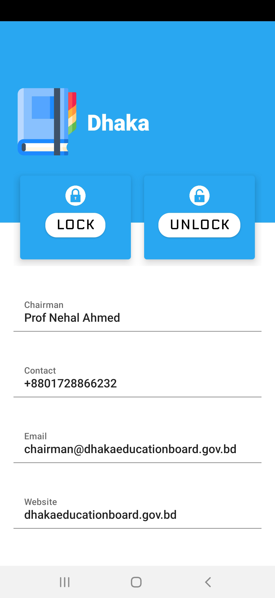
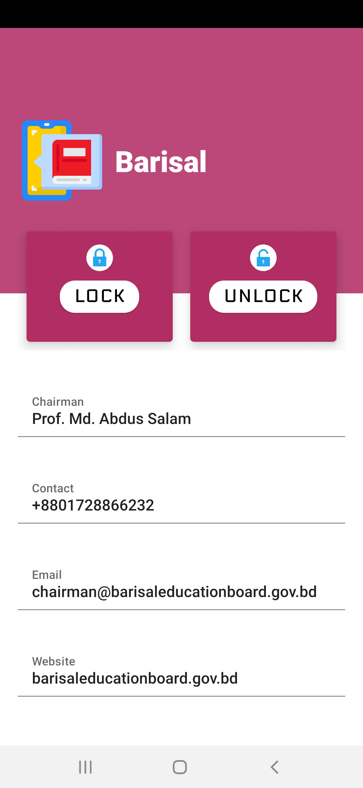
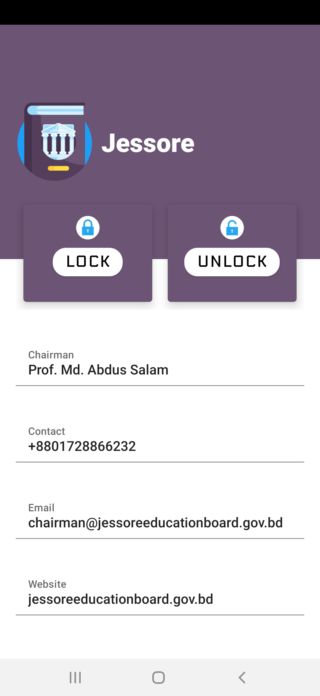
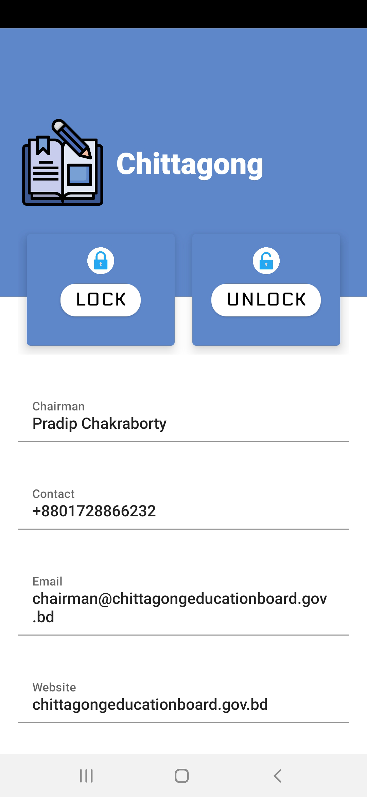
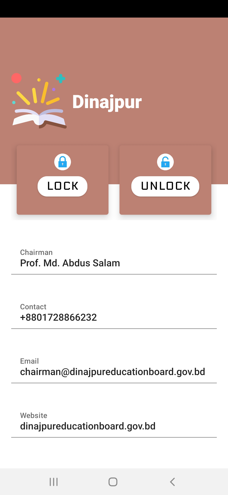

# Shield
SHIELD is a project about terminating the question paper piracy in Bangladesh.
## Problem
Question paper piracy is a national problem in Bangladesh. There are many ways that question papers have been pirated over the years but most of the time, culprits get access to the question papers, take a snap of it and share it over internet.
## How SHIELD would solve it:

We will send question paper to the institutions in a box. By using the App called "Shield" the box can be locked from inside over internet and if someone breaks the box with any authorization of the Ministry of Education it will send an immediate email and notification to the nearest police station and the ministry of education.

__Here is a short clip demonstrating my project:__

https://www.youtube.com/watch?v=ZPBS2nfLD30&t=22s

## Screenshots

         
         

## App Features

- In the app dashboard there are eight different card views consisting the name of the Board under Ministry of Education. For instance Dhaka, Chittagong, Rajshahi, Comilla, Jessore, Sylhet, Dinajpur and Barisal.
- Say we want to LOCK all the boxes under Dhaka Board then we can head over to the Dhaka Board CardView.
- Here we can see the LOCK and UNLOCK button.
- Underneath that we can see the basic information of Dhaka Board.
- If the Authority presses the LOCK button all the boxes under Dhaka board will be LOCKED from inside over internet.
- If some culprits break the box without any authorization of the Ministry of Education the App will send an immediate email and notifiaction to the nearest Police station and the Ministry of Education. 

