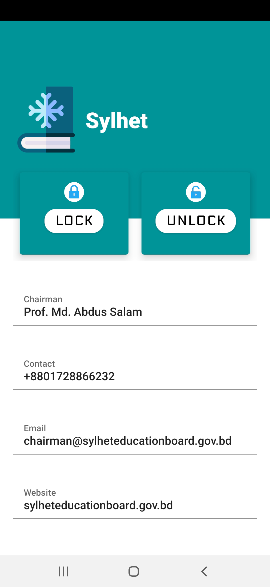

# Shield
SHIELD is a project about terminating the question paper piracy in Bangladesh.
## Problem
Question paper piracy is a national problem in Bangladesh. There are many ways that question papers have been pirated over the years but most of the time, culprits get access to the question papers, take a snap of it and share it over internet.
## How SHIELD would solve it:

We will send question paper to the institutions in a box. By using the App called "Shield" the box can be locked from inside over internet and if someone breaks the box with any authorization of the Ministry of Education it will send an immediate email and notification to the nearest police station and the ministry of education.

Here is a short clip demonstrating my project:

https://www.youtube.com/watch?v=ZPBS2nfLD30&t=22s

         
         

